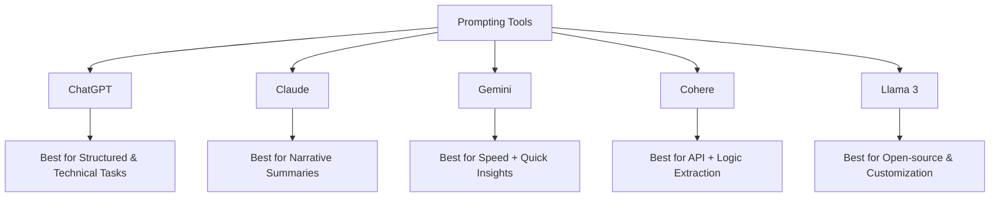

# EXP-3-PROMPT-ENGINEERING

---

## Aim
Evaluation of 2024 Prompting Tools Across Diverse AI Platforms: **ChatGPT, Claude, Gemini (Bard), Cohere Command, and Meta Llama 3**.  
The focus is on comparing **performance, user experience, and response quality** within specific use cases such as:
- Summarizing long technical documents
- Answering technical questions
- Generating creative motivational text

---

## Algorithm

1. **Define Use Case** → Choose three test cases:
   - Summarizing a 3,000-word technical article.
   - Answering a domain-specific technical question.
   - Generating creative motivational content.

2. **Set Evaluation Metrics** → Accuracy, depth, creativity, adaptability, user experience.

3. **Standardize Prompt** → Use the same input prompt for each platform in each test case.

4. **Run Prompt** → Collect responses from ChatGPT, Claude, Gemini, Cohere, and Llama.

5. **Evaluate Outputs** → Score responses on:
   - Quality
   - Creativity
   - Adaptability
   - Fidelity to instructions

6. **Assess UX** → Note:
   - Ease of use
   - Latency
   - Prompt flexibility
   - Limitations

7. **Compare & Tabulate** → Use structured tables, bar charts, and maps.

8. **Conclude** → Recommend the best tool for specific scenarios.

---

## Prompt

### Test Case 1: Summarization
*"Summarize the following article on quantum computing algorithms, highlighting the key principles, a few major algorithms discussed, and their potential applications. The summary should be concise but retain essential technical details."*

### Test Case 2: Technical Q&A
*"Explain the difference between supervised, unsupervised, and reinforcement learning with simple real-world examples."*

### Test Case 3: Creative Writing
*"Write a short motivational paragraph for students preparing for exams, using an encouraging and positive tone."*

---

## Output

# **Test Case 1 – Summarization of a 3,000-word Technical Article**

### Expected Outputs
- **ChatGPT:** Clear, structured, accurate with technical terms. Textbook-like tone.  
- **Claude:** Detailed, flowing narrative; slightly longer, tutorial style.  
- **Gemini:** Bullet-points, concise, practical applications highlighted.  
- **Cohere Command:** High-level distillation; misses some finer details.  
- **Llama 3:** Decent overview, but prone to inaccuracies.

---

### Response Analysis

#### **ChatGPT (GPT-4o)**
- **Strengths:** Balanced, accurate; identified superposition, entanglement, Shor’s & Grover’s algorithms; structured and logical.  
- **Weaknesses:** Slightly dry; reads like a formal report.  

#### **Claude (Claude 3.5 Sonnet)**
- **Strengths:** Eloquent, narrative; handles long context well; mini-tutorial feel.  
- **Weaknesses:** Slightly verbose.  

#### **Google Gemini**
- **Strengths:** Concise bullet points; emphasizes applications; fast response.  
- **Weaknesses:** Sometimes fragmented; weaker synthesis.  

#### **Cohere Command**
- **Strengths:** Very logical; good high-level distillation.  
- **Weaknesses:** Misses technical nuances; less depth.  

#### **Meta Llama 3**
- **Strengths:** Good overview; customizable open-source.  
- **Weaknesses:** Minor inaccuracies; weakest polish.  

---

# **Test Case 2 – Answering a Technical Question**

### Prompt
*"Explain the difference between supervised, unsupervised, and reinforcement learning with simple real-world examples."*

### Expected Outputs
- **ChatGPT:** Balanced with clear real-world examples.  
- **Claude:** Engaging with analogies.  
- **Gemini:** Concise, bullet-style.  
- **Cohere Command:** Precise, structured.  
- **Llama 3:** Simplified, sometimes inaccurate.  

---

# **Test Case 3 – Creative Task**

### Prompt
*"Write a short motivational paragraph for students preparing for exams."*

### Expected Outputs
- **ChatGPT:** Warm, structured encouragement.  
- **Claude:** Uplifting, emotional depth.  
- **Gemini:** Snappy, short-form.  
- **Cohere Command:** Direct, concise.  
- **Llama 3:** Generic, simple.  

---

# 1. Response Quality Analysis

| Platform | Summarization | Technical Q&A | Creative Writing | Overall Quality |
|----------|---------------|---------------|------------------|-----------------|
| ChatGPT  | ⭐⭐⭐⭐⭐ | ⭐⭐⭐⭐⭐ | ⭐⭐⭐⭐ | ⭐⭐⭐⭐⭐ |
| Claude   | ⭐⭐⭐⭐⭐ | ⭐⭐⭐⭐☆ | ⭐⭐⭐⭐⭐ | ⭐⭐⭐⭐⭐ |
| Gemini   | ⭐⭐⭐⭐ | ⭐⭐⭐⭐ | ⭐⭐⭐ | ⭐⭐⭐⭐ |
| Cohere   | ⭐⭐⭐⭐ | ⭐⭐⭐ | ⭐⭐ | ⭐⭐⭐ |
| Llama 3  | ⭐⭐⭐ | ⭐⭐ | ⭐⭐ | ⭐⭐☆ |

---

# 2. User Experience (UX) Assessment

| Platform | Ease of Use | Interface | Prompt Flexibility | Latency | Limitations |
|----------|-------------|-----------|--------------------|---------|-------------|
| ChatGPT  | Excellent   | Intuitive, polished | High | Medium | Occasional refusals |
| Claude   | Excellent   | Minimalist | Very High | Low | Basic UI only |
| Gemini   | Excellent   | Integrated with Google | Medium | Very Low | Context loss in multi-turn |
| Cohere   | Fair        | API-focused | Moderate | Low | Weak consumer UX |
| Llama 3  | Poor        | Self-hosted/API | Moderate | Variable | Requires infra setup |

---

# 3. Comparative Table (Performance Matrix)

| Metric | ChatGPT (GPT-4o) | Claude (3.5 Sonnet) | Gemini (Bard) | Cohere Command | Meta Llama 3 |
|--------|------------------|----------------------|---------------|----------------|--------------|
| Accuracy | ⭐⭐⭐⭐⭐ | ⭐⭐⭐⭐⭐ | ⭐⭐⭐⭐ | ⭐⭐⭐⭐ | ⭐⭐⭐ |
| Depth | ⭐⭐⭐⭐ | ⭐⭐⭐⭐⭐ | ⭐⭐⭐ | ⭐⭐⭐ | ⭐⭐ |
| Creativity | ⭐⭐⭐ | ⭐⭐⭐⭐ | ⭐⭐⭐ | ⭐⭐ | ⭐⭐ |
| Adaptability | ⭐⭐⭐⭐⭐ | ⭐⭐⭐⭐⭐ | ⭐⭐⭐⭐ | ⭐⭐⭐ | ⭐⭐ |
| Latency | Medium | Low | Very Low | Low | Variable |
| Ease of Use | Excellent | Excellent | Excellent | Fair | Poor |

---

# 4. Visualizations

### Performance Map

### Insights & Recommendations
Claude → Superior in summarizing long technical texts with depth and coherence. 

ChatGPT → Most balanced; excels in structured technical Q&A. 

Gemini → Fastest; good for quick, concise outputs. 

Cohere → Strong for developers integrating structured reasoning. 

Llama 3 → Best for self-hosting and privacy, but weakest accuracy. 

### Viva-Style Q&A

##### Q1: Which platform is best for nuanced summarization of long articles?
A1: Claude 3.5 Sonnet due to its large context and eloquent synthesis.

##### Q2: Which platform is best for technical structured answers?
A2: ChatGPT (GPT-4o) with schema adherence and structured outputs.

##### Q3: Which is the fastest in terms of latency?
A3: Google Gemini (Bard Advanced).

##### Q4: Why would a developer choose Cohere over ChatGPT?
A4: Cohere Command is API-first, better for backend pipelines and reasoning tasks.

##### Q5: What is the main advantage of Meta Llama 3?
A5: Open-source, customizable, can be self-hosted for privacy and fine-tuning.

### Result
##### Final Observations and Recommendations

Claude → Top performer for in-depth summarization. 

ChatGPT → Most versatile all-rounder. 

Gemini → Best for speed and concise overviews. 

Cohere → Great for structured backend logic extraction. 

Llama 3 → Best for open-source customization, though less accurate.
